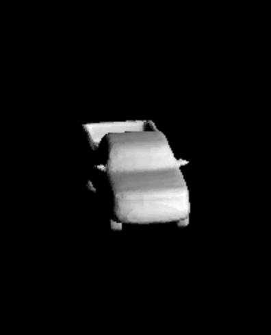
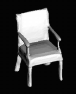
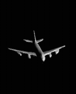
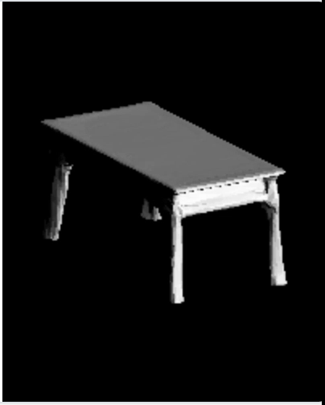
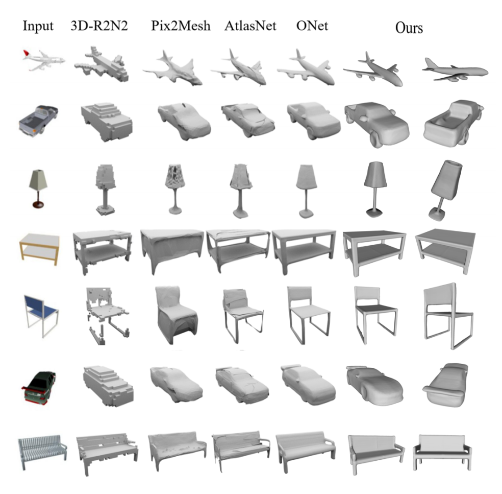

# DmifNet





## Citing this work
If you find our code or paper useful, please consider citing
```
@article{li2020dmifnet,
  title={DmifNet: 3D Shape Reconstruction Based on Dynamic Multi-Branch Information Fusion},
  author={Li, Lei and Wu, Suping},
  journal={arXiv preprint arXiv:2011.10776},
  year={2020}
}
```

## Configuration Environment
```
Python3.6, Pytorch: 1.0, CUDA: 9.0+, Cudnn: follow Cuda version, GPU: one Nvidia RTX 2080Ti
Epoch: Approximately close to the optimal convergence value between 1500 and 2500 epoch
```

## Installation
First you have to make sure that you have all dependencies in place.

You can create an anaconda environment called `dmifnet_space` using
```
conda env create -f dmif_env.yaml
conda activate dmifnet_space
```

Then, compile the extension modules.
```
python set_env_up.py build_ext --inplace
```
Then, download the BatchNet modules.

* download the [BatchNet](https://pan.baidu.com/s/1KzcgkiE-gxTy1-cw0ikaAA) via BaiDu and Extracted key is [1234]([1234]) 
* download the [BatchNet](https://drive.google.com/file/d/1fqDrqU_wMb_EbHCprZkOIWWxSiXPxaJK/view?usp=sharing) via Google

Next, put your model path in DmifNet/dmifnet/encoder/batchnet.py /def resnet18(pretrained=False, **kwargs):


## Generation
To generate meshes using a trained model, use
```
python generate.py ./config/img/dmifnet.yaml
```

## Training
```
python train.py ./config/img/dmifnet.yaml
```

## DataSet
You can check the baseline work Onet to download the dataset[ONet and DmifNet: DataSet](https://s3.eu-central-1.amazonaws.com/avg-projects/occupancy_networks/data/dataset_small_v1.1.zip). Thanks for contribution of baseline work.

## Evaluation

First, to generate meshes using a trained model, use
```
python generate.py ./config/img/dmifnet.yaml
```

Then, for evaluation of the models, you can run it using

```
python eval_meshes.py ./config/img/dmifnet.yaml
```
also can use quick evaluation(don't need generation).
```
python eval.py ./config/img/dmifnet.yaml
```

## Pretrained model
you can download our pretrained model via Baidu Netdisk or Google Drive

* download the [DmifNet](https://pan.baidu.com/s/1nihobjv6dW5RVt2Zw2Ycjw) via BaiDu and Extracted key is [3hfs]([5iwg]) 
* download the [DmifNet](https://drive.google.com/file/d/1rOJaAnJlg0RmTiiBg2RiSXO8QYsv8fs1/view?usp=sharing) via Google


## Quantitative Results
Method | Intersection over Union | Normal consistency | Chamfer distance 
:-: | :-: | :-: | :-: 
3D-R2N2 | 0.493 | 0.695 | 0.278  
Pix2Mesh | 0.480 | 0.772 | 0.216 
AtlasNet | -- | 0.811 | 0.175 
ONet | 0.571 | 0.834 | 0.215
DmifNet | 0.607 | 0.846 | 0.185

## Qualitative Results


# Futher Information
If you have any problems with the code, please list the problems you encountered in the issue area, and I will reply you soon.
Thanks for  baseline work [Occupancy Networks - Learning 3D Reconstruction in Function Space](https://avg.is.tuebingen.mpg.de/publications/occupancy-networks).

