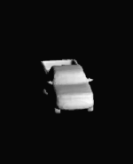

# DmifNet



## Installation
First you have to make sure that you have all dependencies in place.

You can create an anaconda environment called `dmifnet_space` using
```
conda env create -f dmif_env.yaml
conda activate dmifnet_space
```

Then, compile the extension modules.
```
python setup.py build_ext --inplace
```
## Dataset
You can download our preprocessed data using
```
bash scripts/download_data.sh
```

## Generation
To generate meshes using a trained model, use
```
python generate.py yourpath/dmifnet.yaml
```

## Eval
For evaluation of the models, you can run it using

```
python eval_meshes.py yourpath/dmifnet.yaml
```
## Pretrained model
you can download our pretrained model via
* download the [DmifNet](https://pan.baidu.com/s/1lQPaBSiZbEPFT1e2qiH0zA) and password is [5iwg] `. 

# Futher Information
Thanks for  baseline work [Occupancy Networks - Learning 3D Reconstruction in Function Space](https://avg.is.tuebingen.mpg.de/publications/occupancy-networks).
If you find our code or paper useful, please consider citing

   @inproceedings{DmifNet,
        title = {DmifNet: 3D shape Reconstruction based on Dynamic Multi-branch Information Fusion},
        author = {Lei Li, Suping Wu},
    }
